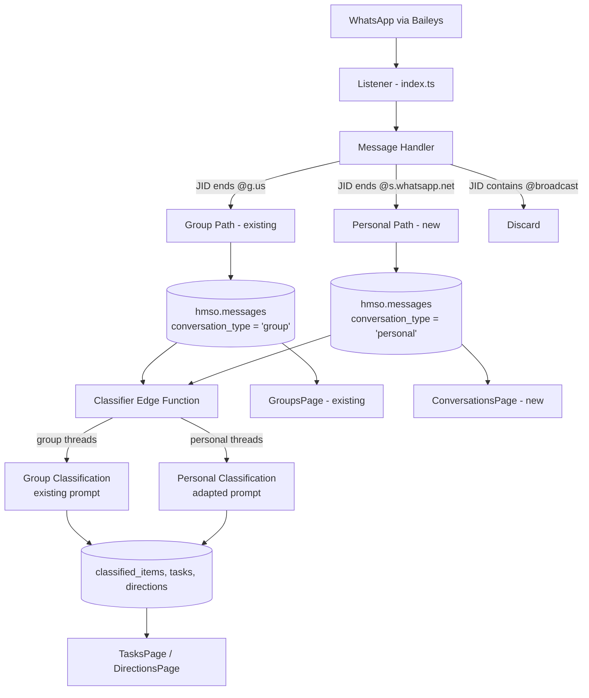

# Design Document: Personal Messages Capture

## Overview

This feature extends the HMSO system to capture, store, classify, and display personal/direct WhatsApp messages alongside the existing group message pipeline. The core change is removing the `@g.us`-only filter in the message handler and adding a `conversation_type` discriminator to the unified `hmso.messages` table. The classification edge function gains awareness of personal message context, and a new frontend page provides a contact-based conversation view.

The design prioritizes backward compatibility — all existing group message flows (capture, classification, frontend views, briefings) remain untouched. Personal messages flow through the same pipeline with type-aware branching at key decision points.

## Architecture



### Key Design Decisions

1. **Unified messages table**: Personal messages go into the same `hmso.messages` table with a `conversation_type` discriminator column, rather than a separate table. This keeps the classification pipeline unified and avoids data duplication.

2. **Nullable `wa_group_id`**: The existing `NOT NULL` constraint on `wa_group_id` is relaxed to allow NULL for personal messages. A new `wa_contact_jid` column stores the other party's JID for personal messages.

3. **Branching at classification**: The classifier detects `conversation_type` and uses a different system prompt for personal messages, since the context (1-on-1 conversation vs group discussion) changes how messages should be interpreted.

4. **Broadcast filtering**: Status broadcasts (`@broadcast` JIDs) are explicitly discarded — they are WhatsApp Status updates, not personal messages.

## Components and Interfaces

### 1. Database Migration

A single migration file adds:
- `conversation_type TEXT NOT NULL DEFAULT 'group'` column to `hmso.messages`
- `wa_contact_jid TEXT` column to `hmso.messages`
- Relaxes `wa_group_id` from `NOT NULL` to nullable
- Indexes on new columns
- Registers new objects in `hm_core.object_registry`

### 2. Message Handler (`message-handler.ts`)

Modified `handleMessage()` function:

```typescript
export async function handleMessage(msg: WAMessage) {
  const remoteJid = msg.key?.remoteJid;
  if (!remoteJid) return;

  // Discard broadcast/status messages
  if (remoteJid.includes('@broadcast')) return;

  const isGroup = remoteJid.endsWith('@g.us');
  const isPersonal = remoteJid.endsWith('@s.whatsapp.net');

  if (!isGroup && !isPersonal) return; // Unknown JID type

  if (isGroup) {
    await handleGroupMessage(msg, remoteJid);
  } else {
    await handlePersonalMessage(msg, remoteJid);
  }
}
```

- `handleGroupMessage()`: Existing logic extracted into its own function, sets `conversation_type = 'group'`
- `handlePersonalMessage()`: New function that determines sender/contact JID, sets `conversation_type = 'personal'`, `wa_group_id = null`, `wa_contact_jid = remoteJid`

### 3. Classifier Edge Function (`classify-messages/index.ts`)

Modified to:
- Include personal messages in `fetchUnclassifiedMessages()` query
- Group personal messages by `wa_contact_jid` + reply chains in `groupMessagesIntoConversations()`
- Use a personal-message-aware system prompt when `conversation_type = 'personal'`
- Set `group_name` to contact display name for personal message tasks/directions

### 4. Frontend — ConversationsPage

New page component at `/conversations`:
- Left panel: Contact list with message counts and last message time
- Right panel: Message thread for selected contact
- Classification badges on messages
- Uses the same Supabase client and auth patterns as GroupsPage

### 5. Frontend — Navigation & Routing

- Add `{ to: '/conversations', icon: MessageCircle, label: 'DMs' }` to `navItems` in `Layout.tsx`
- Add `<Route path="conversations" element={<ConversationsPage />} />` in `App.tsx`

### 6. TypeScript Types (`types.ts`)

Extended `Message` interface:
```typescript
export interface Message {
  // ... existing fields ...
  conversation_type: 'group' | 'personal';
  wa_contact_jid: string | null;
}
```

## Data Models

### Modified: `hmso.messages`

| Column | Type | Nullable | Default | Notes |
|--------|------|----------|---------|-------|
| conversation_type | TEXT | NOT NULL | 'group' | 'group' or 'personal' |
| wa_group_id | TEXT | YES (changed) | NULL | NULL for personal messages |
| wa_contact_jid | TEXT | YES | NULL | Contact JID for personal messages |

All other columns remain unchanged.

### New Indexes

| Index | Columns | Condition |
|-------|---------|-----------|
| idx_messages_conversation_type | conversation_type | — |
| idx_messages_contact_jid | wa_contact_jid | WHERE wa_contact_jid IS NOT NULL |
| idx_messages_personal_contact_time | wa_contact_jid, timestamp DESC | WHERE conversation_type = 'personal' |

### Existing Tables — No Changes

- `hmso.groups` — unchanged
- `hmso.contacts` — unchanged (personal message contacts are resolved via existing Contact_Resolver)
- `hmso.classified_items` — unchanged (works with any message)
- `hmso.tasks` — unchanged (`group_name` field reused for contact name)
- `hmso.directions` — unchanged (`group_name` field reused for contact name)

### Views — Minimal Changes

- `hmso.today_summary` — add `WHERE conversation_type = 'group'` filter to preserve existing behavior
- `hmso.overdue_tasks` — no change needed


## Correctness Properties

*A property is a characteristic or behavior that should hold true across all valid executions of a system — essentially, a formal statement about what the system should do. Properties serve as the bridge between human-readable specifications and machine-verifiable correctness guarantees.*

### Property 1: JID routing produces correct field values

*For any* incoming WhatsApp message, if the remote JID ends with `@s.whatsapp.net`, the stored record should have `conversation_type = 'personal'`, `wa_group_id = NULL`, `group_id = NULL`, and `wa_contact_jid` equal to the remote JID. If the remote JID ends with `@g.us`, the stored record should have `conversation_type = 'group'`, `wa_group_id` equal to the remote JID, and `wa_contact_jid = NULL`.

**Validates: Requirements 1.4, 2.1, 2.2, 2.3, 2.4, 2.8**

### Property 2: Broadcast messages are discarded

*For any* incoming message whose remote JID contains `@broadcast`, the Message_Handler should not insert any record into the messages table.

**Validates: Requirements 2.7**

### Property 3: Hendra detection in personal messages

*For any* personal message where the sender JID matches the configured `hendraJid`, the stored record should have `is_from_hendra = true` and `wa_contact_jid` should be the remote JID (the other party, not Hendra).

**Validates: Requirements 2.6**

### Property 4: Contact resolution for personal messages

*For any* personal message processed by the Message_Handler, the stored record should have a non-null `contact_id` (the sender was resolved via Contact_Resolver).

**Validates: Requirements 2.5**

### Property 5: Classifier fetches both message types

*For any* set of unclassified messages containing both group and personal messages, the classifier's fetch query should return messages of both conversation types.

**Validates: Requirements 3.1**

### Property 6: Personal message thread grouping by contact

*For any* set of personal messages, the conversation grouping function should group messages by `wa_contact_jid` (and reply chains within), never mixing messages from different contacts into the same conversation thread.

**Validates: Requirements 3.2**

### Property 7: Prompt selection matches conversation type

*For any* conversation thread, if all messages have `conversation_type = 'personal'`, the built prompt should contain personal/direct conversation context. If all messages have `conversation_type = 'group'`, the built prompt should contain group conversation context.

**Validates: Requirements 3.3, 5.4**

### Property 8: Source attribution for personal message classifications

*For any* personal message classified as a task or direction, the created task/direction record should have `group_name` set to the contact's display name rather than a group name or JID.

**Validates: Requirements 3.4, 3.5**

### Property 9: Today summary excludes personal messages

*For any* mix of group and personal messages on the current date, the `today_summary` view should only count messages where `conversation_type = 'group'`.

**Validates: Requirements 5.3**

### Property 10: Contact list ordered by most recent message

*For any* set of personal message contacts, the contact list query should return contacts ordered by their most recent message timestamp in descending order.

**Validates: Requirements 4.1**

### Property 11: Message thread in chronological order

*For any* contact's personal message thread, the messages should be returned in ascending chronological order by timestamp.

**Validates: Requirements 4.2**

### Property 12: Contact list info completeness

*For any* contact in the personal messages contact list, the rendered output should include the contact name, message count, and last message timestamp.

**Validates: Requirements 4.3**

### Property 13: Message display info completeness

*For any* personal message displayed in the conversation view, the rendered output should include sender name, timestamp, message text, and classification badge (if classified).

**Validates: Requirements 4.4, 4.6**

### Property 14: Media-only messages stored correctly

*For any* personal message that contains only media (image, video, sticker, document) without a caption, the stored record should have `message_text = NULL` and `message_type` matching the media type (e.g., 'image', 'video', 'sticker').

**Validates: Requirements 6.2**

## Error Handling

| Scenario | Handling |
|----------|----------|
| Personal message insert fails (non-duplicate) | Log error with message ID and sender JID, skip message, continue processing |
| Personal message insert fails (duplicate `23505`) | Silently skip — message already stored |
| Contact resolution fails for personal message | Log warning, store message with `contact_id = NULL` |
| Unknown JID format (not `@g.us`, `@s.whatsapp.net`, or `@broadcast`) | Silently discard — log at debug level |
| Classifier encounters personal message with no `wa_contact_jid` | Skip message in grouping, log warning |
| Frontend fails to load personal messages | Show error state with retry button, same pattern as GroupsPage |
| Migration fails mid-way | Migration is idempotent (IF NOT EXISTS / IF EXISTS) — safe to re-run |

## Testing Strategy

### Unit Tests

- Message handler JID routing: verify correct branching for `@g.us`, `@s.whatsapp.net`, `@broadcast`, and unknown JIDs
- `extractText()` and `detectMessageType()` functions with personal message payloads
- Conversation grouping function with mixed group/personal messages
- Prompt builder output for personal vs group conversations
- Contact list query ordering
- Today summary view filtering

### Property-Based Tests

Property-based tests use **fast-check** (TypeScript PBT library) with minimum 100 iterations per property.

Each test is tagged with: **Feature: personal-messages-capture, Property {N}: {title}**

Key properties to implement as PBT:

1. **Property 1** (JID routing): Generate random JIDs of both types, verify field assignment
2. **Property 2** (Broadcast discard): Generate random broadcast JIDs, verify no storage
3. **Property 6** (Thread grouping): Generate random personal messages from multiple contacts, verify grouping isolation
4. **Property 7** (Prompt selection): Generate random conversations of both types, verify prompt content
5. **Property 9** (Today summary): Generate random mixes of group/personal messages, verify count exclusion
6. **Property 14** (Media messages): Generate random media message types, verify storage fields

### Integration Tests

- End-to-end: personal message arrives → stored in DB → classified → visible in frontend query
- Migration: run migration on test DB with existing group messages, verify backward compatibility
- Classifier: process a batch containing both group and personal messages, verify correct prompt selection
